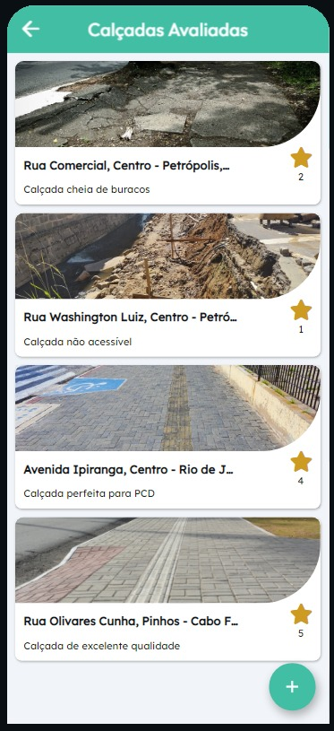

# HackatonaMob4.0
Projeto mapeamento de calçadas Hackatona Mob 4.0 2022

Como funciona:

Nossa api cruza os dados do nosso banco com a api do googlemaps "https://maps.googleapis.com/maps/api" e verifica se o local já foi avaliado,
o dispositivo móvel do usuário passa os parametros de localização automaticamente, o google retorna o dados do local, onde acrescentamos nossa avaliação e gravamos em nosso banco de dados.
https://apibioplus.herokuapp.com/biomob-api/places/supermarket/-22.5112498/-43.1779306/2000

  

O do aplicativo objetivo é facilitar o input dos dados pelo usuário, temos o envio atravéz do formulário no app, podemos receber inputs por arquivos excel, csv..,
a a possibilidade de uso de tecnologia de mapeamento por imagem, usando o próprio dispositivo móvel, drones, cameras...
