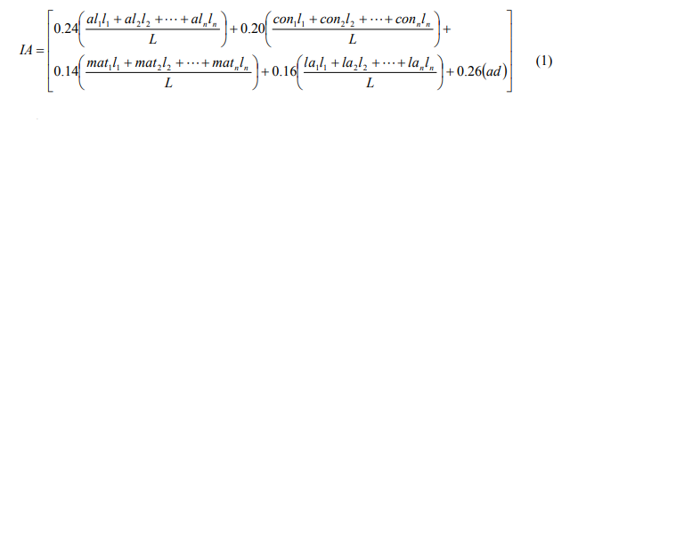
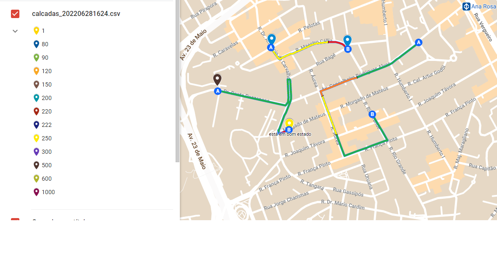

# HackatonaMob4.0
Projeto Rotas acessiveis com mapeamento de calçadas Hackatona Mob 4.0 2022

Como funciona:

Desenvolvemos uma api que cruza as informações do nosso banco de dados  com a api do googlemaps "https://maps.googleapis.com/maps/api" e verifica se o local já foi avaliado, o dispositivo móvel do usuário passa os parametros de localização automaticamente, o google retorna o dados do local, onde acrescentamos nossas avaliações e salvamos novamente no banco.
Link da api com exemplo de alguns filtros:
https://apibioplus.herokuapp.com/biomob-api/places/supermarket/-22.5112498/-43.1779306/2000

 
 

  
</>

 
 
A avaliação de calçadas poderá ser incorporado a outros aplicativos já existentes, como o caso do app BiomobPlus que já avalia locais de acessibilidade.
O aplicativo visa facilitar o input dos dados pelo usuário, podemos incluir os dados atravéz do formulário no app, receber tabelas de arquivos excel, csv.., fazer mapeamento por imagem, usando o próprio dispositivo móvel, drones, cameras...
 
 

  

 
 

São gerados no mapa marcadores com as avaliações e as informaçoe das calçadas, o usuário poderá selecionar um destino e o aplicativo indicará se a rota é acessivel 
através do cálculo de um índice que mede a qualidade da acessibilidade oferecida. Esse índice, denominado IA – Índice de Acessibilidade, é calculado pela equação
1.
 
 

  

 
 
onde:
ali, coni, mati, lai, representam, respectivamente, a pontuação obtida pelo trecho i da calçada na avaliação técnica dos aspectos de alinhamento do greide, estado de conservação do pavimento, tipo de material usado e largura efetiva ad representa a pontuação obtida na avaliação técnica da adequação da travessia. 
 
 
 
 
 
 

  
</>

