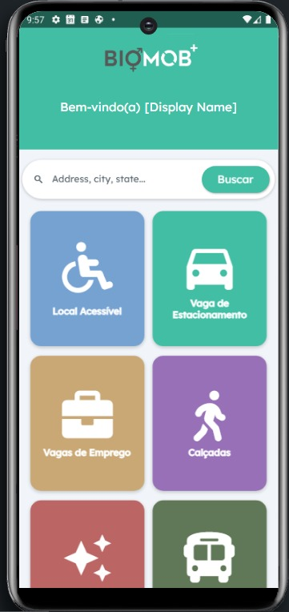

# HackatonaMob4.0
Projeto Rotas acessiveis com mapeamento de calçadas Hackatona Mob 4.0 2022

Como funciona:

Desenvolvemos uma api que cruza as informações do nosso banco de dados  com a api do googlemaps "https://maps.googleapis.com/maps/api" e verifica se o local já foi avaliado, o dispositivo móvel do usuário passa os parametros de localização automaticamente, o google retorna o dados do local, onde acrescentamos nossas avaliações e e salvamos novamente no banco.
Link da api com exemplo de alguns filtros:
https://apibioplus.herokuapp.com/biomob-api/places/supermarket/-22.5112498/-43.1779306/2000

  

  

A avaliação de calçadas poderá ser agregrado a outros aplicativos já existentes, como o caso do app BiomobPlus que já avalia locais de acessibilidade.
O aplicativo visa facilitar o input dos dados pelo usuário, podemos inputar os dados atravéz do formulário no app, receber tabelas de arquivos excel, csv.., fazer mapeamento por imagem, usando o próprio dispositivo móvel, drones, cameras...

  

